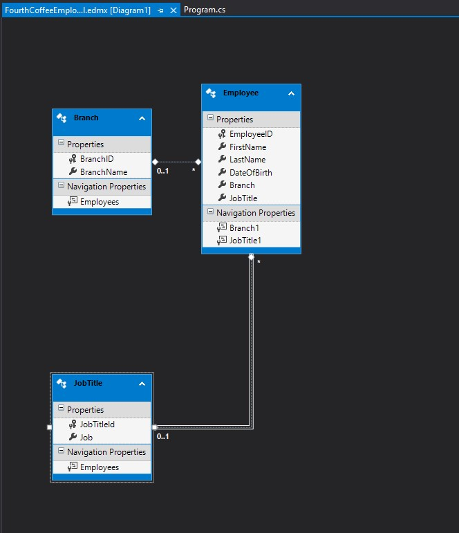

## MOD 7 - Accessing a  Database (19)

### L1:Creating and  Using Entity Data Models

#### Demonstration:  Creating an Entity Data Model

#### Demonstration: Reading and Modifying Data in an EDM

20483C_MOD07_DEMO.md